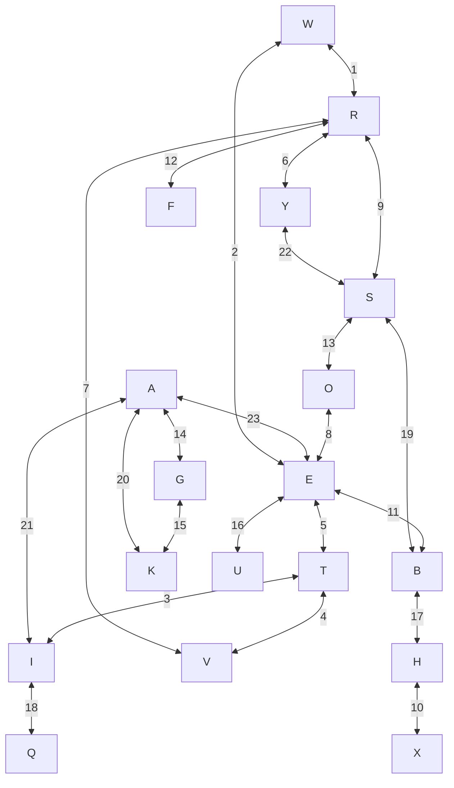
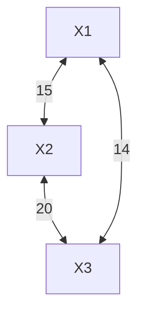
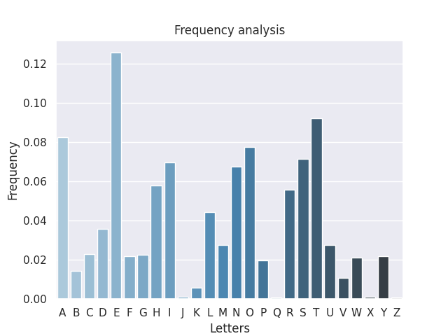

# Esercizi di approfondimento
## Un crittogramma di Vigenere
Dato il sequente ciphertext:
```Python
ciphertext = \
"OKZARVGLNSLFOQRVVBPHHZAMOMEVHLBAITLZOWSXCSZFEQFICOOVDXCIISOOVXEIYWNHHLVQHSOWD"+\
"BRPTTZZOWJIYPJSAWQYNOYRDKBQKZPHHTLIHDEMICGYMSEVHKVXTQPBWMEWAZZKHLJMOVEVHJYSJR"+\
"ZTUMCVDGLZVBUIWOCPDZVEIGSOGZRGGOTAHLCSRSCXXAGPDYPSYMECRVPFHMYWZCYHKMCPVBPHYIF"+\
"WDZTGVIZEMONVYQYMCOOKDVQIMSOKLBUEBFZISWSTVFEWVIAWACCGHDRVVZOOBANRYHSSQBUIMSDW"+\
"VBNRXSSOGLVWKSCGHLNRYHSSQLVIYCFHVWJMOVEKRKBQMOOSVQAHDGLGWMEOMCYOXMEEIRTZBCFLZ"+\
"BVCVPRQVBLUHLGSBSEOUWHRYHSSEIEVDSCGHZRGOSOPBBUIQWNHRZFEIRPBWMEXCSPASBLXZFCWWW"+\
"EMZGLDDBUIOWNTHVPICOOTRZOMYRPBKMEIIHCOQKRWCSNFRAFIYWEKLBUSPHEVHAYMBVESVBGVZAZ"+\
"FVPRAJIWRQMIIMUZPDKXXJHSSRBUIMGTRHBUIMSHCXTQFZBZFHBHVIOYRWPRXCFPSRNGLZAVBHEVX"+\
"OVPMZMEIAIWZBIJEMSEVDBGLZMHSUMGVVWWWQOGLZCCPLARWYSNZLVRXCOEHKMLAZFPGLVXMIUHWW"+\
"PVXDBECWPRJDBLZQQTLOALFHBUIKOEVZWHPYPPRLNSMXIWHWPNXOCZHKMLOISH"
```
decifrare il testo tratto dalla lingua inglese utilizzando il metodo degli **indici di coincidenza**, eventualmente accoppiato con il metodo di **Kasiski**. Illustrare i vari passaggi in particolare:
1. ripetizioni nel testo, le loro distanze e i valori di $m$ (lunghezza della chiave) da esse suggerite;
2. i valori degli indici di coincidenza che si ottengono per il valore corretto di $m$;
3. per ciascuna delle $m$ lettere della chiave, indicare come  è stato individuato lo shift che dà il valore della chiave.

Per aiutarmi con la decrifrazione ho implementato i passaggi dell'attacco in Python.

Iniziamo l'attacco prendendo il `ciphertext` e dividendolo in tri-grammi con la funzione `split_text(ciphertext, m_gram_len)`. Ora che abbiamo una lista di tri-grammi dobbiamo individuare contare quali sono quelli che appaiono più di 2 volte nel testo. Uttilizzando la funzione `get_high_frequency_m_grams(m_grams)` otteniamo un dizionario con i tri-grammi frequenti.

Stampando il dizionario restituito dalla funzione otteniamo:
```
High frequency m_grams:
{'BUI': 4, 'HKM': 3}
```

Sappiamo quindi che i tri-grammi più frequenti sono **BUI** e **HKM**, con rispettivamente 4 e 3 ripetizioni.
Applichiamo il metodo di **Kasiski** per avere un canditato alla lunghezza della chiave $m$.
Dobbiamo quindi calcolare le distanze tra questi tri-grammi, in particolare dal primo tri-gramma con le sue ripetizioni.
Fatto ciò, calcoliamo il **MCD** tra queste distanze. Il risultato ci suggerirà l'ipotetica lunghezza della chiave.

Il problema descritto sopra è facilmente risolvibile con un **ciclo for** che in questo caso ha solo 2 iterazioni. Ad ogni iterazione dobbiamo calcolare le posizioni del tri-gramma all'interno della lista con `get_positions(m_grams, key)`,
calcolarci le distanze tra la prima occorreza con le altre, tramite la funzione `get_distances(positions, key)` ed infine eseguire il **MCD** tra queste distanze con `gcd.reduce(distances`.

Il codice finale è il seguente:
```Python
key_lenghts = list()
for key in high_frequency.keys():
    positions = get_positions(m_grams, key)
    distances = get_distances(positions, key)
    key_lenght = gcd.reduce(distances)
    key_lenghts.append(key_lenght)
print("Possible key lenghts:\n{key_lenghts}".format(key_lenghts=key_lenghts))
```
L'output è:
```
Element BUI positions:
[55, 143, 191, 239]
Elemt BUI distances:
[88, 136, 184]
Element HKM positions:
[73, 225, 249]
Elemt HKM distances:
[152, 176]
Possible key lenghts:
[8, 8]
```
In entrami i casi, questo metodo ci suggerisce una lunghezza della chiave pari a 8.

Ora che abbiamo un valore di $m$ possiamo calcolare gli indici di coincidenza.
Per farlo dobbiamo prima convertire il `ciphertext` in una matrice di dimensione $m*(n/m)$ dove n è la lungezza del `ciphertext` e utilizziamo la funzione `build_matrix(chypertext, m)` che è la seguente:
```Python
def build_matrix(text: str, m: int) -> np.ndarray:
    text = add_padding(text, m)
    matrix = np.array([sring_to_number(text[i:i+m]) for i in range(0,len(text),m)])
    return np.transpose(matrix)
```
Nel testo è stato aggiunto del padding per far tornare la divisione.
Per ogni riga della matrice (8) possiamo calcolare l'indice di coincidenza, calcolabile con la funzione `coincidence_index(row)`.
Ciclando su ogni riga della matrice otteniamo il seguente risultato:
```
Row 0: 0.064501679731243
Row 1: 0.07592385218365062
Row 2: 0.08085106382978725
Row 3: 0.05688689809630459
Row 4: 0.07928331466965287
Row 5: 0.07569988801791715
Row 6: 0.05867861142217245
Row 7: 0.0815229563269877
```
Questi numeri sono abbastanza vicini al valore atteso 0.065, quindi concludiamo che 8 è il valore corretto della chiave.

A questo punto possiamo determinare i singoli valori della chiave utilizzando la seguente formula:
$$M^g(y_i)=\sum_{j=0}^{25}{p_j}(\frac{f_{g+j}}{n/m})$$
Per ciascuma delle 8 righe delle matrice calcoliamo $M^g$.
```Python
key = list()
for row in cyphertext:
    max_list = list()
    for g in range(26):
        sum = 0
        for j in range(26):
            sum += p[j]*(frequency_vector(row)[(g+j)%26]/(len(row)/m))
        max_list.append(sum)
    key.append(max_list.index(max(max_list)))
print(key)
print(number_to_string(key))
```
Otteniamo quindi i massimi valori raggiunti per ogni carattere della chiave, che corrisponde alla lettera in numeri.

L'output è:
```
[21, 14, 11, 14, 3, 8, 13, 4]
VOLODINE
```
Possiamo ora decifrare il testo con `ciphertext[i]-key[i%m])%26`.
Il codice completo è:
```Python
ciphertext = np.transpose(cyphertext)
ciphertext = ciphertext.ravel()
decripted = list()
for i in range(len(ciphertext)):
    decripted.append((ciphertext[i]-key[i%m])%26)
print(number_to_string(decripted))
```
Che da come output il seguente testo:
```
TWOMONTHSEARLIERANETERNITYTHEDOWNFALLOFTHEORBISEHADHAPPENEDASPREDICTEDIMMEDIATELY
FOLLOWEDBYEXODUSANDACOMPLETELYEMPTYFUTURETHECITYCENTERSFLOWEDWITHTHEBLOODOFREPRIS
ALSTHEBARBARIANSHADRECLAIMEDPOWERJUSTLIKEEVERYWHEREELSEONTHEPLANETVASSILISSAMARAC
HVILIHADWANDEREDWITHAGROUPOFPARTISANSFORSEVERALDAYSANDTHENTHERESISTANCEHADDISPERS
EDANDTHENDIEDOUTSOWITHTWOCOMRADESINDISASTERKRONAUERANDILYUSHENKOSHEMANAGEDTOGETAR
OUNDTHEBARRIERSERECTEDBYTHEVICTORSANDENTERTHEEMPTYTERRITORIESAPATHETICFENCEHADFOR
BIDDENHERENTRANCESHECROSSEDITWITHOUTTHESLIGHTESTTREMORSHEWOULDNEVERGOBACKTOTHEOTH
ERSIDETHEREWOULDBENORETURNANDTHETHREEOFTHEMKNEWITTHEYWEREFULLYAWARETHATTHEYWERETR
AILINGTHEORBISESDECLINETHATTHEYWERESINKINGWITHITINTOTHEFINALNIGHTMARETHEPATHWOULD
BEDIFFICULTTHATTOOTHEYKNEWJUPKT
```
## Enigma
### Domanda A
**Dare una formula per il numero possibili di chiavi Enigma. Dare un ordine di grandezza come multiplo di una potenza di 10 e di tale numero dire a quanti bit corrisponde. Calcolare il numero esatto di possibili stati iniziali.**

La chiave è composta da 3 elementi:
1. Scelta dei 3 rotori da un insieme di 5 rotori: $5\cdot4\cdot3 = 60$
2. Posizione iniziale dei 3 rotori: $26^3$
3. Connessionioni alla plugboard: Combinazione di 26 lettere dove vanno rimossi i 6 punti fissi. Di queste connessioni l'ordine delle coppie e l'ordine di ciascuna coppia non è rilevante, quindi vanno rimossi rispettivamente $10!$ e $2^{10}$.
Otteniamo quindi $\frac{26!}{6!\cdot10!\cdot2^{10}}$ possibili connessioni.

Moltiplicando questi 3 fattori otteniamo circa:
$$\frac{1.9547\cdot10^{24}}{1.2288\cdot10^4}$$
che è esprimibile come $10^{20}$ che richiede 66 bit, cioè quasi uno **zettabyte**.
Gli stati iniziali possibili, cioè l'inieme dei 3 rotori e la loro posizione iniziale è $60\cdot26^3 = 1054560 = 1.05456\cdot10^6$.

### Domanda B
**Dimostrare che, detta $\rho$ la permutazione realizzata dalla macchina in uno stato qualsiasi, $\rho$ è un involuzione e non ha punti fissi. Dire come può essere ottenuta la decryption.**

Per dimostrare che $\rho$ è un involuzione, sostituiamo i valori dalla quale è composta.
Otteniamo il seguente risultato:
$$\sigma\alpha^{\prime}\beta^{\prime}\gamma^{\prime}\pi\gamma\beta\alpha\sigma\sigma^{\prime}\alpha^{\prime}\beta^{\prime}\gamma^{\prime}\pi^{\prime}\gamma\beta\alpha\sigma^{\prime}(x) = x$$

Quindi è un involuzione, questo perchè partendo dalla posizione centrale dell'equazione $\sigma\sigma^{\prime}$ tutte le funzioni si annullanno.

La decryption può essere effettuata impostando la chiave nella macchina e digitando il ciphertext su di essa. Criptando il ciphertext otteniamo il plaintext.

### Domanda C
**Dato il frammento di plaintext `WETTERVORHERSAGEBISKAYA`, si confronti con il ciphertext intercettato `QFZWRWIVTYRESXBFOGKUHQBAISEZ` e si determini una possibile coppia (plaintext,ciphertext)**

Una coppia possibile è la seguente:

| | | | |1| 2| 3 |4 |5 |6 |7 |8 |9 |10| 11 |12 |13 |14 |15 |16 |17 |18 |19 |20 |21 |22 |23| |
|--|--|--|--|--|--|--|--|--|--|--|--|--|--|--|--|--|--|--|--|--|--|--|--|--|--|--|--|
| | | | |W |E |T |T |E |R |V |O |R |H |E |R |S |A |G |E |B |I |S |K |A |Y |A| |
|Q|F|Z|W|R |W |I |V |T |Y |R |E |S |X |B |F |O |G |K |U |H |Q |B |A |I |S |E|Z|

### Domanda D
**Si disegni il menù relativo alla coppia CRIB-CIPHERTEXT per il CRIB dato precedentemente. Se be individuino tutti i cicli.**

Il menù relativo è il seguente:

I cicli possibili sono 10 (senza tener conto dell'nodo di partenza):

1. AKGA
2. RSYR
3. ETIAE
4. ETIVRWE
5. EBSRWE
6. EBSRVITE
7. EBSRVIAE
8. EBSYRWE
9. EBSYRVITE
10. EBSYRVIAE

## Domanda F
**Si descriva un modo di connettere opportunamente tre macchine Enigma in cascata per
controllare l’esistenza di un ciclo del tipo**

**in un grafo di
Turing relativo ad un qualsiasi stato iniziale.**

Le macchine Enigma vanno inserite sugli archi e devono restiturie i nodi del grafo.

# Esercizi di programmazione
Per eseguire il codice bisogna prima installare le dipendenze:
```
pip install -r requirements.txt
```
Il codice eseguibile è:

- [Frequency_analysis.py](/src/Frequency_analysis.py)
- [Hill_cipher.py](/src/Hill_cipher.py)
- [Hill_attack.py](/src/Hill_attack.py)

## Analisi delle frequenze di un testo
L'istogramma delle frequenze del testo è il seguente:



Indici di coincidenza, distribuzione empirica e entropia degli m-grammi sono disponibili nel file di log [frequency_analysis.log](/Logs/frequency_analysis.log)

### Funzionamento
Dato $m = 1,2,3,4,5$ si prepara il testo del capito 1 di Moby Dick.
Dato che il file è abbastanza grande, un generatore restituisce riga per riga il testo, che è la funzione `read_text_file(text)`.
Ad ogni riga vengono rimossi tutti i caratteri che non siano lettere con `remove_special_characters(line)`, viene divisa in m-grammi con `m_gram_split(line, m_gram_len)` e viene aggiornato il contatore degli m-grammi.
Finite tutte le righe del testo si può calcolare la frequenza dei vari m-grammi con  `calculate_frequency(count)` e abbiamo cosi un dizionario formato da m-gramma:frequenza.

Il procedimento spiegato sopra è racchiuso nella seguente funzione:

```Python
def process_text_file(text: str,m_gram_len:int) -> dict[str, int]:
    text_gen = read_text_file(text)
    count = Counter()
    for line in text_gen:
        line = remove_special_characters(line)
        line = m_gram_split(line, m_gram_len)
        count.update(line)
    count = dict(count)
    frequency = calculate_frequency(count)
    return sort_by_name(frequency)
```
Addesso possiamo calcolare gli **indici di coincidenza** utilizzando il dizionario, creato in precedenza, e la funzione `calculate_index_of_coincidence(frequency)`, che è la seguente:
```Python
def calculate_index_of_coincidence(frequency:dict)->float:
    index_of_coincidence = 0.0
    for key in frequency:
        index_of_coincidence += frequency[key] ** 2
    logging.info("[INDEX OF COINCIDENCE]\n{index_of_coincidence}"\
        .format(index_of_coincidence = index_of_coincidence))
    return index_of_coincidence
```

Sempre con lo stesso dizionario possiamo calcolare **l'entropia di Shannon**, tramite la funzione `calculate_shannon_entropy(frequency)` che è:

```Python
def calculate_shannon_entropy(frequency:dict)->float:
    shannon_entropy = 0.0
    for key in frequency:
        shannon_entropy += (frequency[key]) * np.log2(frequency[key])
    shannon_entropy *= -1
    logging.info("[SHANNON ENTROPY]\n{shannon_entropy}".format\ 
    (shannon_entropy = shannon_entropy))
    return shannon_entropy
```

L'istogramma è costruito con la funzione `make_histogram(frequency)` solo se $m=1$. La funzione utilizza sempre il dizionario che abbiamo creato ed è un modulo in `src/lib/plotter.py`

Tutti i risultati della computazione sono scritti nel file di log

## Cifrario di Hill