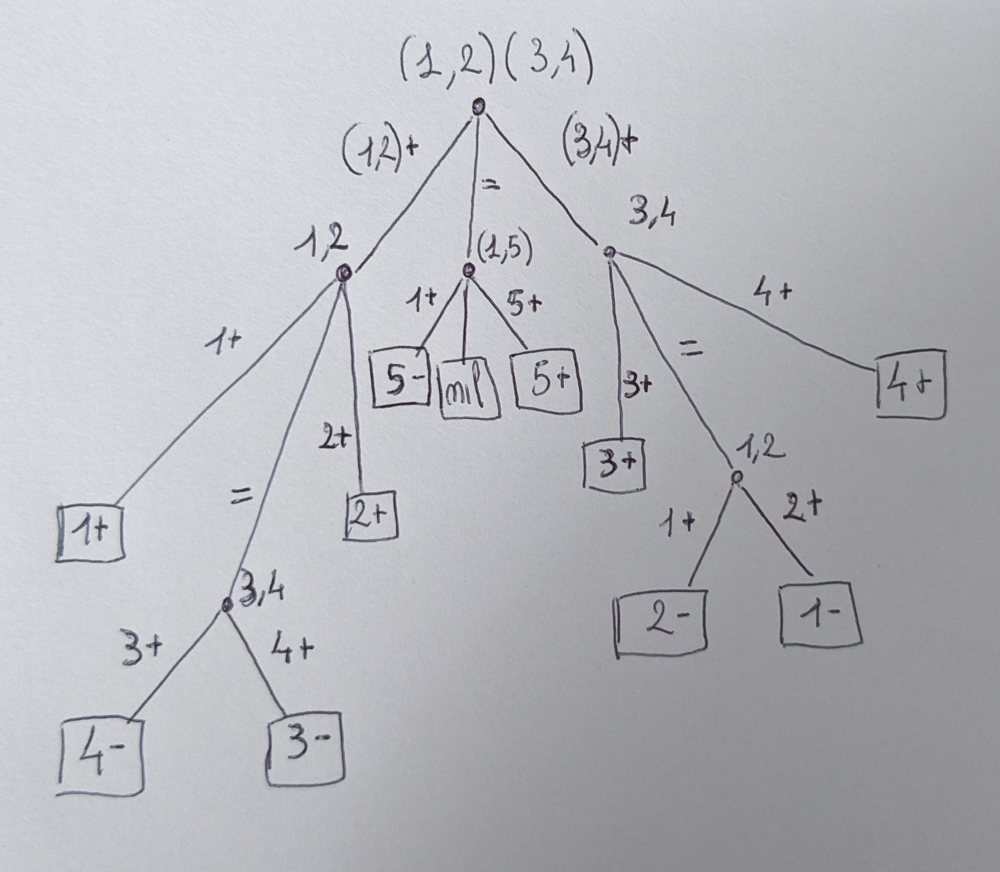

# Esercizi di programmazione
## Codici di Huffman

Programmare in Python **l’algoritmo di Huffman**. La procedura accetta una lista di lettere (l’alfabeto), la relativa distribuzione di probabilità e restituisce un codice istantaneo ottimo per la distribuzione data. Programmare anche una procedura di decodifica che,preso come argomento un generico codice **prefix-free** (non necessariamente Huffman) e una stringa binaria, proceda alla decodifica della stringa.

### Soluzione

Per ottenere un codice prefix-free tramite l'algoritmo di Huffman senza costruire un albero procediamo nel seguente modo:

Dati in input le seguenti liste `alphabet`, `probabilities`, cioè l'alfabeto e le probabilità relative costruiamo una stringa che contine tutte le fusioni in ordine lette da destra a sinistra.

La funzione è la seguente:
```Python
def huffman_encoding(alphabet: list, probabilities: list) -> dict:
    codes = dict(zip(alphabet,probabilities))
    while len(codes) > 1:
        min_prob = find_min_probability(codes.items())
        removed = (min_prob[0],codes.pop(min_prob[0]))
        min_prob = find_min_probability(codes.items())
        if min_prob[1] > removed[1]:
            codes['(' + min_prob[0] + ',' + removed[0] + ')'] = min_prob[1] + removed[1]
        else:
            codes['(' + removed[0] + ',' + min_prob[0] + ')'] = removed[1] + min_prob[1]
        codes.pop(min_prob[0])
    print(codes)
    return generate_code(list(codes.keys())[0])
```

Inizialmente viene creato un dizionario con le liste in input. Ad ogni passo vengono fuse le entrate con probabilità minore. L'`if` è necessario per avere l'elemento con probabilità minure sempre sulla sinistra della lista. Il risultato viene dato in input al generatore di codice `generate_code(codes:str)` che prende in input l'unica entrata del dizionario rimasta che castiamo a lista con `list(codes.keys())[0]`.

Ad esempio:

Inserendo il seguente alfabeto:`['a','b','c','d']` e la seguente probabilità:`[0.9,0.05,0.025,0.025]`, otteniamo la segunete entrata del dizionario: `{'(a,(b,(c,d)))': 1.0}`

Da questa stringa possiamo generare il codice.

```Python
def generate_code(codes:str) -> dict:
    codes = codes.split(',')
    for i in range(len(codes)):
        codes[i] = codes[i].replace('(','').replace(')','')
    code = {}
    if len(codes) == 1:
        code[codes[0]] = '0'
    else:
        for index,element in enumerate(codes):
            code[element] = '1'*index + '0'
        last = code.popitem()
        code[last[0]] = last[1][:-1]
    return code  
```

Come primo passo puliamo la stringa e eliminiamo `,`,`(`e`)` e mettiamo il tutto in una lista. Ordinata in questo modo la codifica sarà semplicemente i-volte `1` concatenato ad uno `0` finale, dove i è la posizione della lettera nella lista (contando ovviamente da 0). Fa eccezione l'ultima lettere dove dobbiamo togliere l'ultimo `0`.

La codifica dell'alfabeto precedente è: `{'a': '0', 'b': '10', 'c': '110', 'd': '111'}`.

Passiamo ora alla decodifica di un generico codice **prefix-free** supponendo che il codice venga passato come un dizionario e la stringa codificata sia binaria.

Essendo il codice prefix-free possiamo decodificare senza effettuare look-forward or backwards.

Infatti sarà suffficiente iniziare a leggere la stringa da sinistra a destra e se troviamo una corrispondenza con una chiave del dizionario, allora possiamo decodificare la lettera e eliminare la sua codifica dalla stringa di input.
Si ripete l'operazione fino al consumo totale dell'input.

>(La prima istruzione inverte la coppia chiave valore nel dizionario, per avere la codifica come chiave).

```Python
def prefix_free_decoding(code: dict, encoded: str) -> str:
    code = {codes:letter for letter,codes in code.items()}
    decoded = ''
    while encoded:
        for key in code.keys():
            if encoded.startswith(key):
                decoded += code[key]
                encoded = encoded[len(key):]
    return decoded
```

Usando l'alfabeto precedente proviamo a decodificare la stringa:
`1101111010000111` che so essere `cdbbaaad`.

Eseguendo:

```Python
    code = huffman_encoding(['a','b','c','d'],[0.9,0.05,0.025,0.025])
    decoded = prefix_free_decoding(code,'1101111010000111') # "cdbbaaad"
    print(decoded)
    assert decoded == 'cdbbaaad'
```
Non otteniamo nessun `AssertionError`.

# Esercizi di approfondimento
## Strategie e codici
In un gioco sono date n monete, etichettate con numeri da 1 a n. Il giocatore A, non visto dal
giocatore B, può:
- sostituire una moneta i scelta a caso con una moneta falsa, identica all’aspetto ma più leggera;
- sostituire una moneta i scelta a caso con una moneta falsa, identica all’aspetto ma più pesante;
- non effettuare alcuna sostituzione.
  
Il giocatore B deve individuare l’azione compiuta da A. Allo scopo, B ha a sua disposizione una
bilancia con cui confrontare il peso di gruppi di monete: ad ogni pesata, la bilancia può dire che è
più pesante il piatto di destra, oppure quello di sinistra, oppure che i due piatti hanno ugual peso.
### Soluzione

1. Una strategia con $n=5$ è definita nel seguente albero.



1. La lunghezza massima di pesate (altezza dell'albero) è 3. Il numero medio di pesate è $\frac{7*2+4*3}{11}\approx 2.36$.

## La capacità del piccione viaggiatore
Un comandante che assedia un forte usa dei piccioni viaggiatori per comunicare con gli alleati.
Ogni piccione porta una lettera (8 bit). Viene liberato un piccione ogni 5 minuti. Ogni piccione
impiega tre minuti per raggiungere la destinazione. Si calcoli la capacità in bit/ora di questo
collegamento, nei seguenti due casi.

1. I piccioni raggiungono tutti la destinazione.
2. I nemici abbattono una frazione $\alpha$ dei piccioni, e sostituiscono ogni piccione abbattuto con uno che porta una lettera scelta a caso.

### Soluzione

1. Vengono inviati $\frac{60}{5} = 12 \frac{piccioni}{ora}$, quindi vengono inviati $8*12 = 96 \frac{bit}{ora}$.
2. La probabilità di scegliere un piccione è $(1-\alpha)$, di abbatterlo è $\alpha$ e di scegliere un rimpiazzo è $\frac{1}{256}$. Ogni riga della matrice di probabilità avrà nell'elemento diagonale $(1-\alpha)+\frac{\alpha}{256}$ e tutte le altre entrate a $\frac{\alpha}{256}$. La capicità del canale è dunque data da

$$\log(2^8) - H(((1-\alpha)+\frac{\alpha}{256},\frac{\alpha}{256},...,\frac{\alpha}{256}))$$